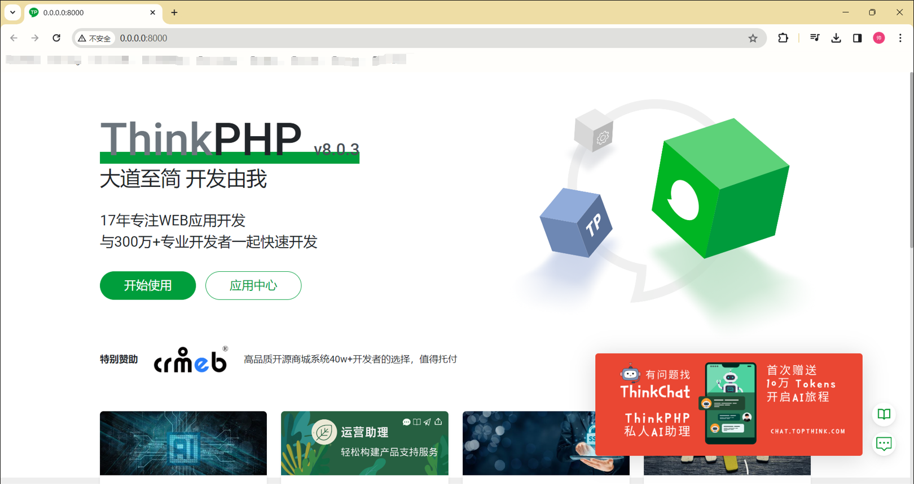
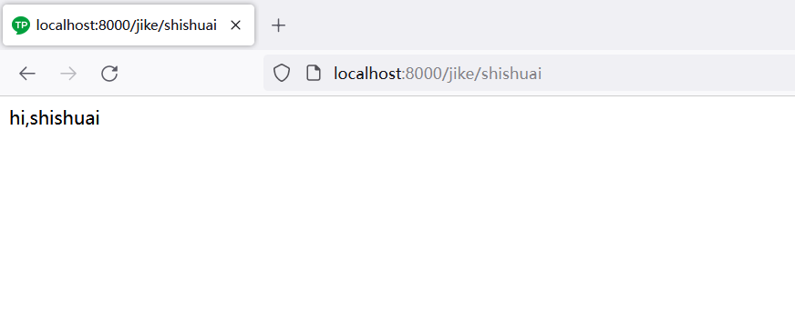
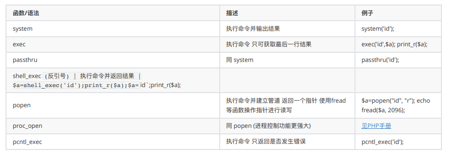
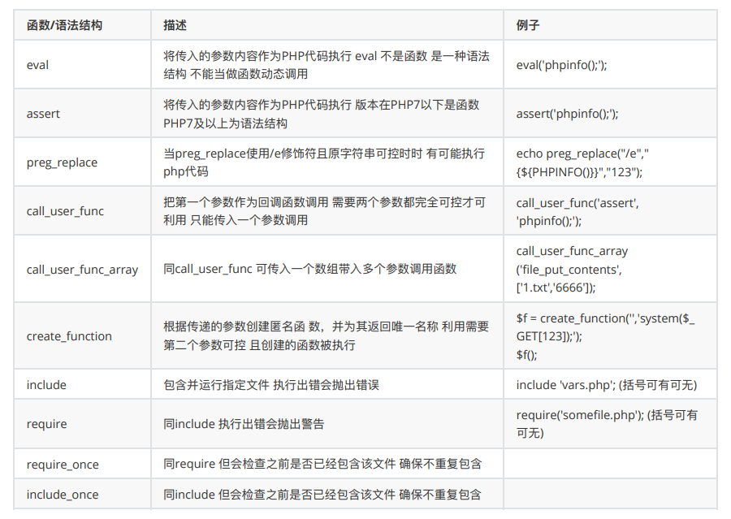
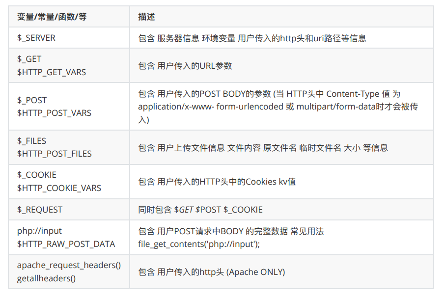
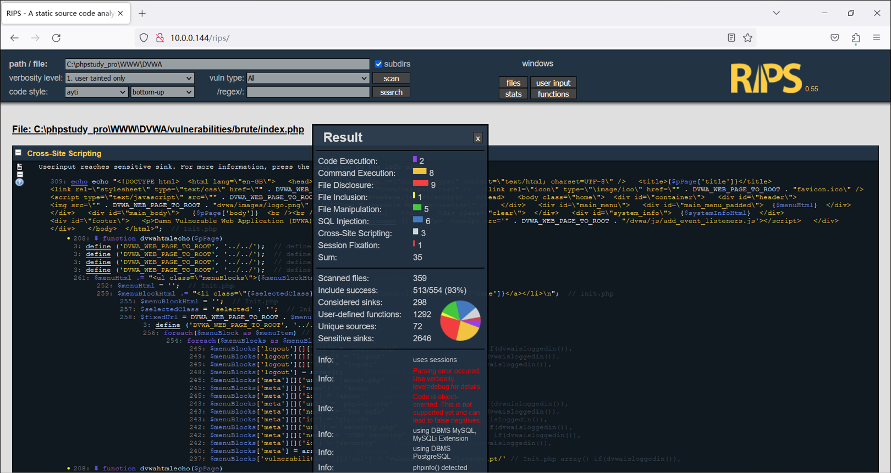

## 1.安装 ThinkPHP 框架。

## 2.在 ThinkPHP 框架中定义’/jike/:name’的路由，输出自己的名字。

## 3.梳理总结所有通用漏洞危险函数，梳理总结所有 PHP 获取用户的函数。

#### 通用漏洞危险函数

命令执⾏函数

mail函数

代码注⼊/⽂件包含函数

#### PHP 获取用户输入的函数

## 4.搭建 RIPS 工具，使用 RIPS 工具扫描 DVWA 代码。

