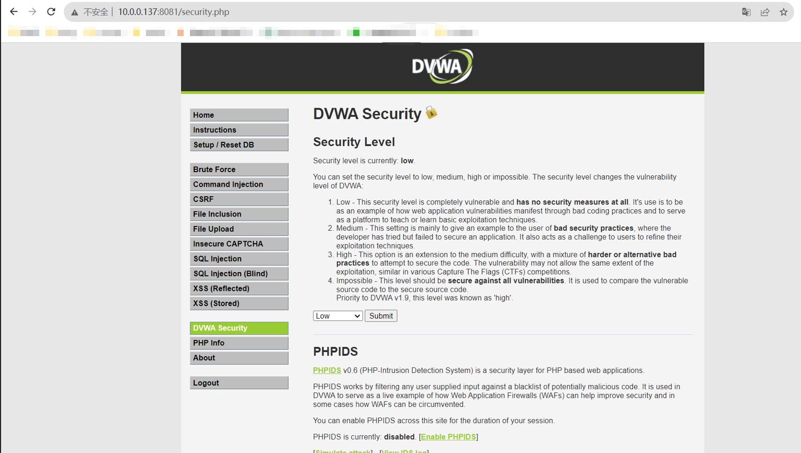
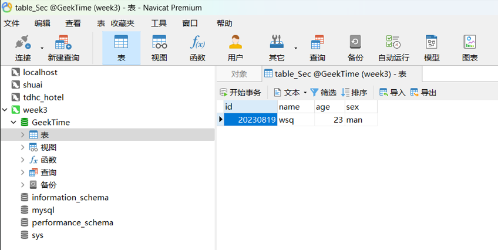

## 1.在 Docker 中分别以后台方式和交互方式启动 CentOS，对比启动后的容器状态，实现退出容器也能保持其运行状态。

[root@shuai ~]# docker run -d centos
f4a08d63b59d7fdf181c3a686745de7483a6cc8b44287897018a1755ff71b5d8
[root@shuai ~]# docker ps  -a
CONTAINER ID   IMAGE     COMMAND       CREATED         STATUS                     PORTS     NAMES
f4a08d63b59d   centos    "/bin/bash"   3 seconds ago   Exited (0) 3 seconds ago             dreamy_hermann
[root@shuai ~]# docker run -it centos
[root@6aaa06edcb66 /]# [root@shuai ~]# docker ps  -a
CONTAINER ID   IMAGE     COMMAND       CREATED          STATUS                      PORTS     NAMES
6aaa06edcb66   centos    "/bin/bash"   25 seconds ago   Up 24 seconds                         condescending_euclid
f4a08d63b59d   centos    "/bin/bash"   50 seconds ago   Exited (0) 49 seconds ago             dreamy_hermann

## 2.在 Docker 中部署 DVWA，要求：DVWA Web 端口映射到 8081，提供访问截图。

## 3.MySQL 练习

- 创建一个名为 GeekTime 的数据库；

  mysql> create database GeekTime;
  Query OK, 1 row affected (0.01 sec)

- 在 GeekTime 数据库中创建一张名为 table_Sec 的表，要求有序号、姓名、年龄、性别字段；

  mysql> use GeekTime;
  Database changed
  mysql> create table table_Sec(
      -> id int not null auto_increment,
      -> name varchar(40)  null,
      -> age int(3) null,
      -> sex varchar(40) null,
      -> primary key(id)
      -> )CHARSET=utf8;
  Query OK, 0 rows affected, 2 warnings (0.01 sec)

- 在 table_Sec 表中插入数据，序号是 20230819，姓名是拼音缩写，年龄、性别无要求 ;

  mysql> insert into table_Sec
      -> (id,name,age,sex)
      -> values
      -> (20230819,"wsq",23,"man");
  Query OK, 1 row affected (0.01 sec)

- 使用 Navicat 连接你所创建的数据库，查看个人信息并提供截图。

