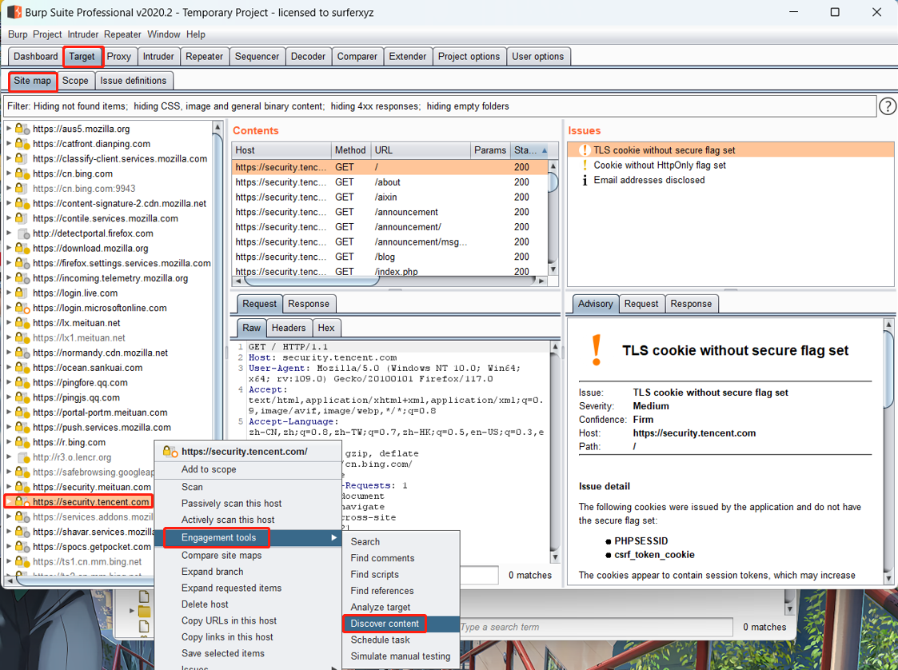
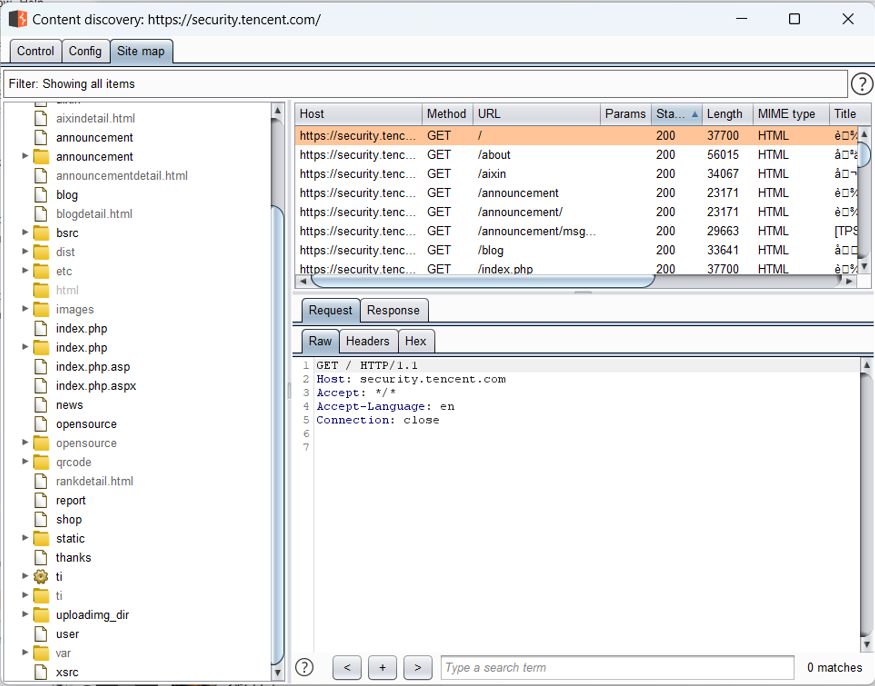

## 1.使用 Burp 的 Discover Content 功能爬取任意站点的目录，给出爬取过程的说明文档、站点树截图；

点击首行 Target 按钮，点击 Site map 页签，选中想要爬取的站点，右键选择 Engagement tools,选中 Discover content 即可开始爬取站点目录

截图如下：

## 2.分别使用 Burp Scan 的主动扫描和被动扫描功能对 DVWA 站点进行扫描，输出扫描报告；

扫描报告在文件夹里

## 3.Burp Intruder 爆破题目

- 老李今年 52 岁了，他最近也在学习网络安全，为了方便练习，他在 DVWA 靶场中增设了一个自己的账号，密码就是他的生日，请你想办法破解出他的账号密码。

  账号：laoli      密码：19710728

- Cookie 老师在 DVWA 靶场中设置了一个账号 Geektime（注意首字母大写），且在靶场中的某处存放了一个文件名为 geekbang.txt 的密码字典，请你想办法找到该字典并尝试爆破，最终获取到账号 Geektime 的正确密码。

  密码：geektime666

## 4.在不依赖于 DVWA 后端数据库的情况，如何通过前端验证的方法判断 DVWA 中的注入点是数字型注入还是字符型注入？（提示：用假设法进行逻辑判断）

先输入 id = 1 and 1= 1，此时语法正确而且逻辑判断为真，返回正常；

再输入 id = 1 and 1= 2，此时语法正确而逻辑判断为假，如果返回错误，说明为数字型注入

字符串一般需要单引号来闭合

先输入 id = 1' and '1'= '1，此时语法正确而且逻辑判断为真，返回正常；

再输入 id = 1' and '1'= '2，此时语法正确而逻辑判断为假，如果返回错误，说明为字符型注入

